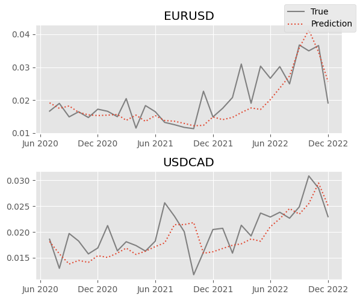
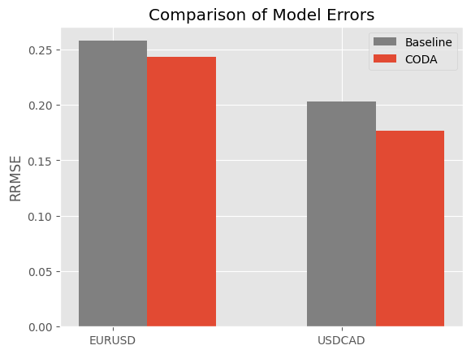

### Introduction
Volatility, a measure of deviation in a distribution over a specific time period, is commonly forecasted by analysing historical volatility as a time series. These approaches overlook the shape and characteristics of the underlying return distribution. In our project, we address this limitation by leveraging the predicted return distribution obtained from functional principle component analysis (FPCA). By incorporating the shape of the distribution, we were able to estimate monthly volatility for two currency pairs more accurately than with a conventional method. In our comparative analysis, our approach outperformed a standard baseline model, showcasing the effectiveness of our methodology.

### Methodology
Density functions don't form a vector space because they are nonnegative and integrate to one. This means that FPCA is not directly applicable. To account for this, we first transform them using the methodology described in Kokoszka et al. [1]. Then we extract the first seven principal component functions and their scores. These scores are then forecasted to produce a step-ahead prediction, which we transform backwards to obtain a forecast for the density functions.

### Data
The raw data consists of daily opening prices for the currency pairs EURUSD and USDCAD from 01/02/2001 to 30/12/2022. The data is then binned into monthly samples consisting of daily logarithmic returns over that month. This histogram data is then used to produce a discretized density function estimate, which maps a return to its (estimated) probability of observation. The models are compared based on their step-ahead forecasts over 30 months, from July 2020 to December 2022.

### Results
The predictions made by our model are compared to the true monthly volatility observations in the following figure:

  

The forecasting error of our model is shown in the figure below, alongside a baseline ARIMA (0, 1, 1) model, as measured by the root relative mean squared error:

  

### References
1. Kokoszka, P., Miao, H., Petersen, A., & Shang, H. L. (2019). Forecasting of density functions with an application to cross-sectional and intraday returns. International Journal of Forecasting, 35:4, pp. 1304-1317.